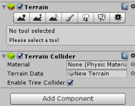

# Priests And Devils v2

- 张浩轩
- 17343149
- 2019-10-01

## 演示视频
http://www.iqiyi.com/w_19s9llhizp.html

## Fantasy Skybox FREE
- 下载 Fantasy Skybox FREE， 构建自己的游戏场景
- 写一个简单的总结，总结游戏对象的使用  
我们在Asset Store中搜索Fantasy Skybox FREE并进行下载, 此时Asset中会新增三个文件夹
  
创建一个Terrain, 然后在Inspector对地形进行修改, 把下载的草地, 树木等植被加载上去, 最终如下图  



## 动作分离
我们新增SSActionManager与Judge类, 并把有关动作的函数放入SSActionManager中, Judege是用来判断游戏结束的类.  
**SSActionManager**部分函数如下, 用来控制船的移动与各个物体点击后的效果
```c#
public static void Move() {
    if (BoatController.if_move) {
        if (BoatController.direction_left) {
            if (BoatController.boat.transform.position.x > -2) {
                BoatController.boat.transform.Translate(new Vector3(-1, 0, 0) * BoatController.speed * Time.deltaTime, Space.World);
            } else {
                BoatController.if_move = BoatController.direction_left = false;
                CreateGUI.run = true;
            }
        } else {
            if (BoatController.boat.transform.position.x < 2) {
                BoatController.boat.transform.Translate(new Vector3(1, 0, 0) * BoatController.speed * Time.deltaTime, Space.World);
            } else {
                BoatController.if_move = false;
                BoatController.direction_left = true;
                CreateGUI.run = true;
            }
        }
    }
}

void OnMouseDown() {
    if (!CreateGUI.run)
        return;
    //在boat上面
    if (this.gameObject.transform.position.y <= BoatController.boat.transform.position.y + 0.61f) {
        string str = this.gameObject.name;
        int pre_index = (str[0] == 'd' ? 3 : 0);
        int index = pre_index + str[str.Length - 1] - '0';
        if (this.gameObject.transform.position.x < BoatController.boat.transform.position.x)
            BoatController.left = true;
        if (BoatController.direction_left) {
            this.gameObject.transform.position = CreateGUI.vec[index];
        } else {
            this.gameObject.transform.position = new Vector3(-CreateGUI.vec[index].x, CreateGUI.vec[index].y, CreateGUI.vec[index].z);
        }
        --BoatController.count;
        this.gameObject.transform.parent = null;
    } else { // 不在boat上面
        if (BoatController.count < 2) {
            if (BoatController.left) { // 左边有空位
                this.gameObject.transform.position = new Vector3(BoatController.boat.transform.position.x - 0.6f, BoatController.boat.transform.position.y + 0.6f, BoatController.boat.transform.position.z);
                BoatController.left = false;
            } else {
                this.gameObject.transform.position = new Vector3(BoatController.boat.transform.position.x + 0.6f, BoatController.boat.transform.position.y + 0.6f, BoatController.boat.transform.position.z);
            }
            ++BoatController.count;
            this.gameObject.transform.parent = BoatController.boat.transform;
        }
    }
}
```

**Judge**专门用来判断游戏结束, 部分函数如下
```c#
public static int judgeEnd() {
    if (Coast.east_priest_count != 0 && Coast.east_priest_count < Coast.east_devil_count)
        return 1; // 东边失败
    else if (Coast.west_priest_count != 0 && Coast.west_priest_count < Coast.west_devil_count)
        return 2; // 西边失败
    else if (Coast.west_priest_count == 3 && Coast.west_devil_count == 3)
        return 0; // 成功
    return 3; // 普通情况
}
```
**Judge**配合下面的代码即可实现游戏结束的判断
```c#
// 判断情况
if (Judge.judgeEnd() == 2 || Judge.judgeEnd() == 1) {
    GUI.Label(new Rect(Screen.width / 2 - 100, Screen.height / 2 - 200, 200, 200), "Failed, reload after 2s", mstyle);
    Invoke("reset", Time.time + 2);
} else if (Judge.judgeEnd() == 0) {
    GUI.Label(new Rect(Screen.width / 2 - 100, Screen.height / 2 - 200, 200, 200), "Success! reload after 2s", mstyle);
    Invoke("reset", Time.time + 2);
}

public void reset() {
    EditorSceneManager.LoadScene(0);
    Coast.reset();
    BoatController.reset();
}
```
